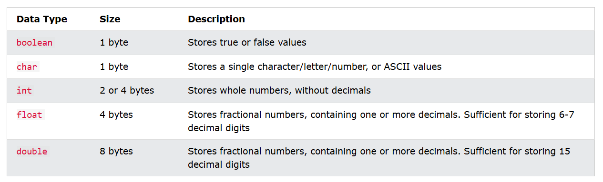
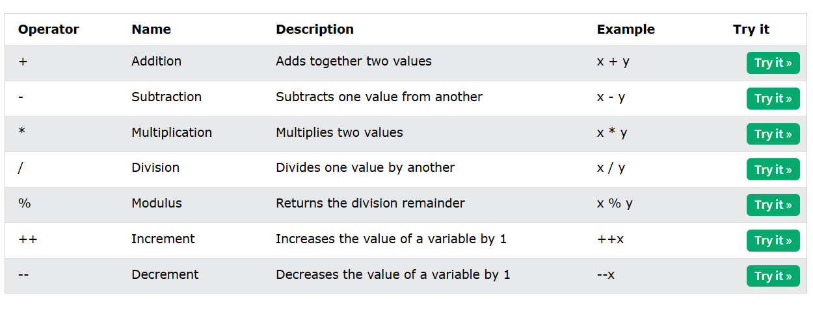
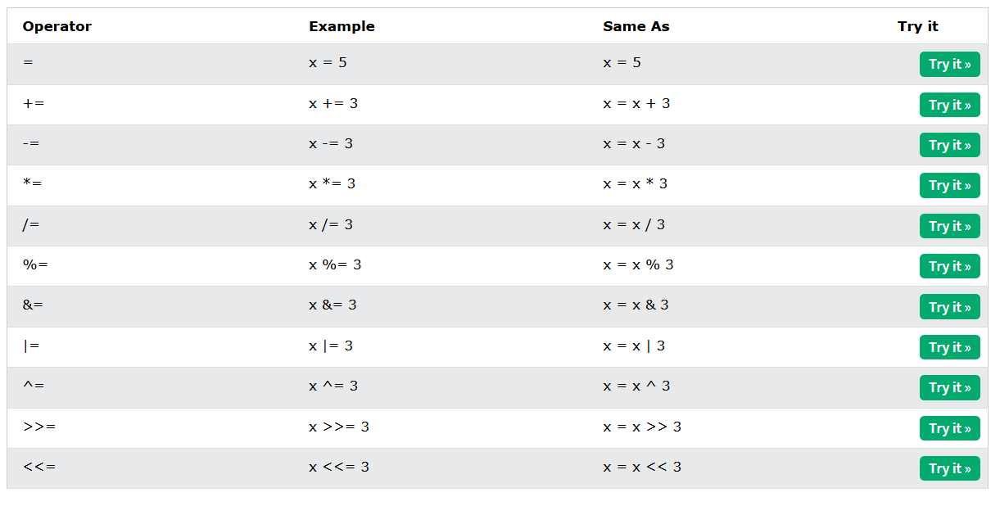
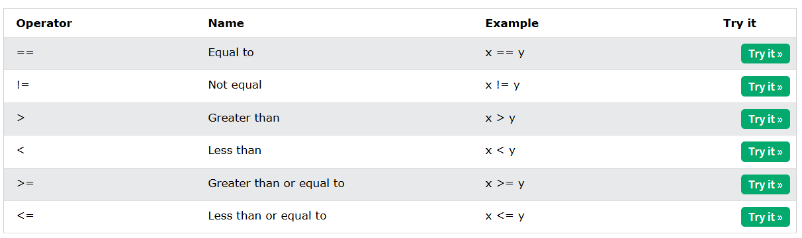
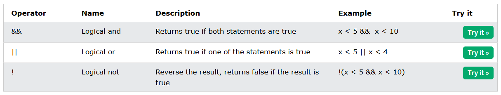

**Readme file**
This folder is made for learning basics of C++ and various resources are used,

# Major cheatsheet
[CheatSheet](https://quickref.me/cpp)

# *Resources used*
--> [Learncpp](https://www.learncpp.com/)
--> [w3schools](https://www.w3schools.com/cpp)

## Data type and thir information.

## Operators

### Arithematic

### Assignment

### Comparison 

### Logical
